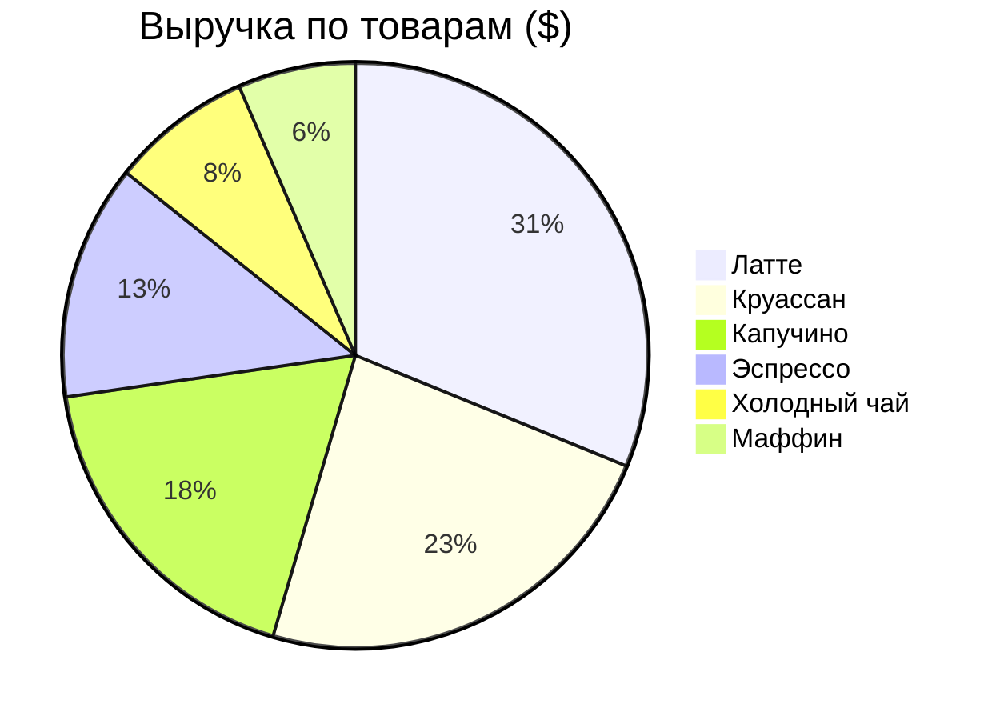

# ☕ Анализ продаж кофейни

## 🎯 Бизнес-задача
Владелец кофейни предоставил выгрузку транзакций за день. Цель проекта — определить, какие товары генерируют наибольшую выручку, чтобы оптимизировать закупки и меню.

## 🛠 Инструменты
* Сбор данных и расчеты: **Google Sheets / Excel**
* Визуализация: **Встроенные графики GitHub (Mermaid)**

## 📊 Распределение выручки

## 💡 Ключевые инсайты

1. **Неожиданный драйвер выручки:** Вопреки ожиданиям, выпечка (Круассаны) принесла огромную долю выручки ($9), обогнав классический утренний Эспрессо ($5). Оказалось, что выпечку покупают сразу по несколько штук (в среднем по 3 шт. в чеке).
2. **Самый прибыльный напиток:** Латте генерирует наибольший доход среди напитков ($12), так как имеет самую высокую маржинальную цену ($4) и стабильный спрос.

## 🚀 Рекомендации для бизнеса
* Ввести акционное утреннее комбо: **"Латте + Круассан"**. Это объединит две самые прибыльные позиции и заставит покупателей кофе чаще брать выпечку, увеличивая средний чек.
